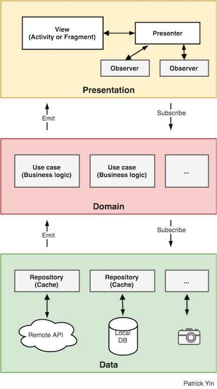

# Android Clean Architecture - Kotlin

***This is an Android Clean Architecture base project using 100% Kotlin including Unit tests!***

You could use it as the base project when you create a new Android project. This architecture optimized the Clean Architecture and MVP for the Android Kotlin project. When using this architecture, you could isolate the UI, business logic and data sources, and also making the unit test easier. It uses latest and most popular technologies e.g. Dagger2, RxJava etc.

## Benefit

* Makes your new project clean
* Isolates UI, business logic and data sources' responsibilities
* Testable
* Avoids multi-threading problems

## Approach of Clean Architecture for Android
There are 3 layers in the project: Data, Domain and Presentation(UI), and the UI layer contains view and presenters.



## Multi-threading
Base `UseCase` class handles the thread of Rx chains, it puts  whole chain on IO thread, and then changes back to Android main thread(UI thread) for the steps after use case execution. That means when you write the project based on this project, then you don't have to worry about any multi-threading issue.

## Requirements &amp; configurations
#### Requirements
JDK 8
Android SDK API 26
Kotlin Gradle plugin 1.2.30 *(it will be installed automatically when this project is synced)*

#### Configurations
minSdkVersion=21
targetSdkVersion=26

## Language
*   [Kotlin](https://kotlinlang.org/)

## Libraries
*   [Android Support Libraries](https://developer.android.com/topic/libraries/support-library/index.html)
*   [Dagger 2](https://google.github.io/dagger/)
*   [RxJava2](https://github.com/ReactiveX/RxJava/wiki/What's-different-in-2.0)
*   [RxAndroid](https://github.com/ReactiveX/RxAndroid)
*   [OkHttp](http://square.github.io/okhttp/)
*   [Retrofit](http://square.github.io/retrofit/)
*   [Gson](https://github.com/google/gson)
*   [JUnit 4](https://junit.org/junit4/)
*   [Mockito](http://site.mockito.org/)
*   [PowerMock](https://github.com/powermock/powermock/)
*   [Espresso](https://developer.android.com/training/testing/espresso/index.html)

## More about The Clean Architecture

[The Clean Architecture](https://8thlight.com/blog/uncle-bob/2012/08/13/the-clean-architecture.html)

[S.O.L.I.D Principle](https://en.wikipedia.org/wiki/SOLID_(object-oriented_design))


More articles available on my blog: <https://medium.com/@pyin001>

## TODO


## Bugs and Feedback

For bugs, feature requests, and discussion please use  [GitHub Issues](https://github.com/patrickyin/clean-architecture-android-kotlin/issues). For general usage questions please use the  [StackOverflow](https://stackoverflow.com/questions/tagged/clean-architecture%20&%20android%20&%20kotlin).

## License

```
Copyright 2017 Patrick Yin

Licensed under the Apache License, Version 2.0 (the "License");
you may not use this file except in compliance with the License.
You may obtain a copy of the License at

   http://www.apache.org/licenses/LICENSE-2.0

Unless required by applicable law or agreed to in writing, software
distributed under the License is distributed on an "AS IS" BASIS,
WITHOUT WARRANTIES OR CONDITIONS OF ANY KIND, either express or implied.
See the License for the specific language governing permissions and
limitations under the License.
```